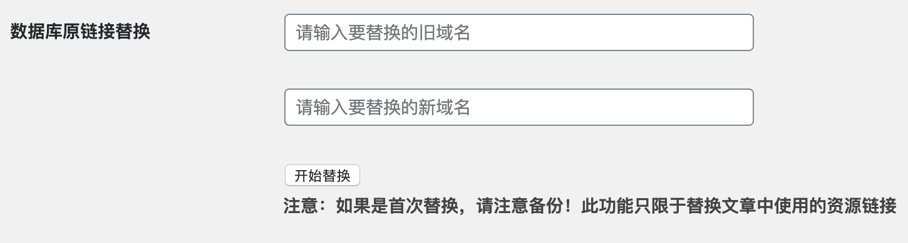
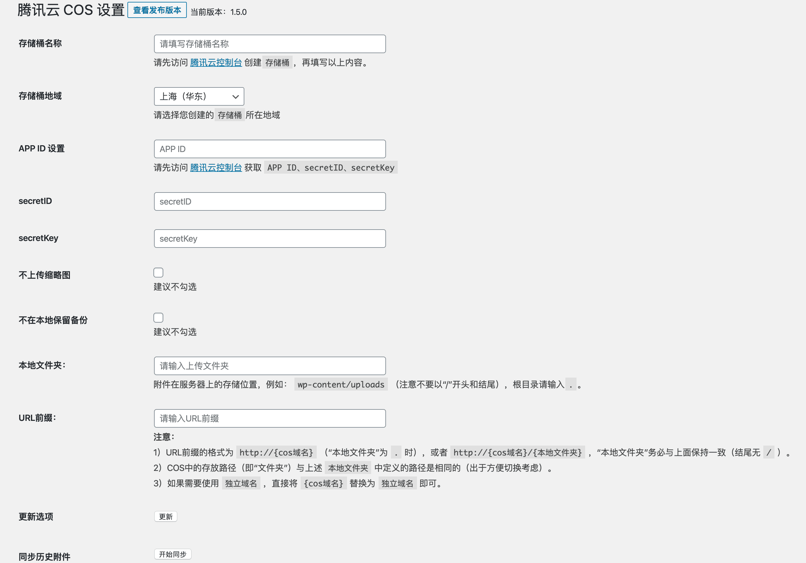

    

使用腾讯云对象存储服务 COS 作为附件存储空间的 WordPress 插件

## 费用

> 腾讯云`COS`目前已修改免费额度，老用户费用不变，长期 50GB

使用`COS`标准存储的新用户，将享受以下免费额度

| 用户类型 | 免费额度         | 有效期 |
| -------- | ---------------- | ------ |
| 个人用户 | 50GB标准存储容量 | 6个月  |
| 企业用户 | 1TB标准存储容量  | 6个月  |

外网下行流量、请求流量、CDN回源流量都单独计费

## 插件特色

* 可配置是否上传缩略图和是否保留本地备份
* 本地删除可同步删除腾讯云上面的文件
* 支持腾讯云COS存储桶绑定自定义域名
* 支持替换数据库中旧的资源链接地址
* 支持北京、上海、广州、香港、法兰克福等完整地域使用

## 安装

### 后台安装

WordPress 后台安装插件页面搜索`Sync QCloud COS`，点击安装

> 2020-01-15：近期会支持，正在和 WordPress Plugin Review Team 沟通

### 下载源码

从 Github 下载源码，通过 WordPress 后台上传安装，或者直接将源码上传到 WordPress 插件目录`wp-content/plugins`，然后在后台启用

Github 下载节点：[https://github.com/sy-records/wordpress-qcloud-cos/releases/latest](https://github.com/sy-records/wordpress-qcloud-cos/releases/latest)

## 修改配置
* 方法一：在 WordPress 插件管理页面有设置按钮，进行设置
* 方法二：在 WordPress 后台管理左侧导航栏`设置`下`腾讯云COS设置`，点击进入设置页面

## 更新记录

2020-01-15
* 升级sdk为v5版本
* 修复本地文件夹和URL前缀结尾`/`去除失败
* 优化URL前缀注意事项提示中的http和https

2020-01-14
* 优化button按钮样式
* 优化sdk中的代码
> v4 sdk的最后一个版本

2020-01-09
* 修复第一次删除文件失败，报错`ERROR_PROXY_APPID_USERID_NOTMATCH`，导致删除文件不完整
* 优化删除逻辑
* 移除时区设置
* 增加发布版本链接
* 修改`README`中的常见问题

2019-11-23
* 修复地域选择上海地区跳转华中问题

2019-11-13
* 修复导致评论时间戳差 8 小时问题

2018-11-30
* 增加数据库链接替换功能

2018-11-04
* 添加北京、香港、法兰克福等完整地域使用

2018-10-30
* 修复变量未定义错误

2018-09-01
* 新增错误 Case

2018-05-22
* 接手更新，创建仓库

## 常见问题

1、怎么替换文章中之前的旧资源地址链接

这个插件已经加上了替换数据库中之前的旧资源地址链接功能，只需要填好对应的链接即可，如图所示

## 配置指南

查看详细教程[https://qq52o.me/2722.html](https://qq52o.me/2722.html)

* 存储桶设置
> 访问 [腾讯云控制台](https://console.cloud.tencent.com/cos5/bucket) 创建存储桶，把创建存储桶时要求你填写的**存储桶名称**，把**存储桶名称**填到这里就可以了，没有后面的`-appid`  
> `examplebucket-1250000000`，其中`examplebucket`为存储桶名称，`1250000000`为 APPID。

* 存储桶地域
> 选择你创建存储桶时所选的地域即可

* APP ID、SecretID、SecretKey
> APP ID 填写上文存储桶设置中所说的`125000000`即可；也可以访问 [腾讯云控制台](https://console.cloud.tencent.com/cos5/key) 获取 APP ID、SecretID、SecretKey

## 插件截图

