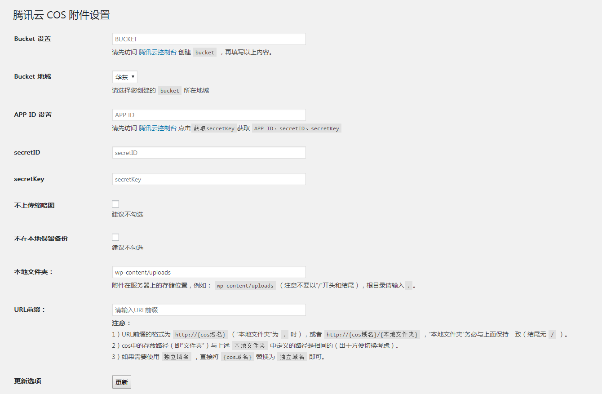

<p align="center">
    
</p>

# Sync QCloud COS

使用腾讯云对象存储服务 COS 作为附件存储空间的 WordPress 插件

[](https://github.com/sy-records/wordpress-qcloud-cos/releases)
[](LICENSE)
[](https://qq52o.me)
[](https://github.com/sy-records/wordpress-qcloud-cos/graphs/contributors)
[](https://wordpress.org/plugins/sync-qcloud-cos/)
[](https://wordpress.org/plugins/sync-qcloud-cos/)

## 插件特色

* [x] 可配置是否上传缩略图和是否保留本地备份
* [x] 本地删除可同步删除腾讯云上面的文件
* [x] 支持腾讯云COS存储桶绑定自定义域名
* [x] 支持替换数据库中旧的资源链接地址
* [x] 支持北京、上海、广州、香港、法兰克福等完整地域使用
* [x] 支持同步历史附件到 COS
* [x] 支持验证桶名是否填写正确
* [x] 支持腾讯云数据万象 CI 图片处理
* [x] 支持上传文件自动重命名

## 安装

### 后台安装（推荐使用）

WordPress 后台安装插件页面搜索`Sync QCloud COS`，点击安装

### 下载源码

从 Github 下载源码，通过 WordPress 后台上传安装，或者直接将源码上传到 WordPress 插件目录`wp-content/plugins`，然后在后台启用

Github 下载节点：[https://github.com/sy-records/wordpress-qcloud-cos/releases/latest](https://github.com/sy-records/wordpress-qcloud-cos/releases/latest)

## 修改配置

* 方法一：在 WordPress 插件管理页面有设置按钮，进行设置
* 方法二：在 WordPress 后台管理左侧导航栏`设置`下`腾讯云COS设置`，点击进入设置页面

## Contributors

This project exists thanks to all the people who contribute. [[Contributors](https://github.com/sy-records/wordpress-qcloud-cos/graphs/contributors)].

<a href="https://github.com/sy-records/wordpress-qcloud-cos/graphs/contributors"></a>

## 常见问题

1. 怎么替换文章中之前的旧资源地址链接

这个插件已经加上了替换数据库中之前的旧资源地址链接功能，只需要填好对应的链接即可

2. 使用子账户报错`Cos Error Code: AccessDenied, Status Code: 403`

可以使用子账户，但是 APPID 需要填写为存储桶创建者的ID，而不是子账户的ID。例如下文配置指南中的`1250000000`就是APPID

3. 上传图片提示`图像后期处理失败，请将其缩小到2500像素并重新上传`

1）配置的`存储桶名称`填写错误，正确的配置参照 [配置指南](https://github.com/sy-records/wordpress-qcloud-cos#%E9%85%8D%E7%BD%AE%E6%8C%87%E5%8D%97) 中的`存储桶名称`
> v1.6.1 版本增强了校验，填写错误会给予提示；同时兼容了桶名称附带`APPID`的情况

2）图片确实像素大于2500px，可以在`functions.php`中加入以下代码禁止大图片裁剪功能

```php
add_filter('big_image_size_threshold', '__return_false');
```

4. 从媒体库中删除了图片，但是`COS`中还是存在

原因是在配置页面选择了`不在本地保留备份`，因为WordPress机制问题，无法获取对应的文件信息

5. 在插件中应该如何使用腾讯云数据万象CI

参考：[腾讯云对象存储COS + 数据万象CI = 完善的图片解决方案](https://cloud.tencent.com/developer/article/1606153) 或 [腾讯云文档 - 使用图片样式](https://cloud.tencent.com/document/product/436/42214#.E4.BD.BF.E7.94.A8.E5.9B.BE.E7.89.87.E6.A0.B7.E5.BC.8F)

6. 保存配置时报错：`您的站点遇到了致命错误，请查看您的站点的管理电子邮箱来获得指引`

这个问题应该只出现在Windows的机器上，打开`WP_DEBUG`的话会报错：`Fatal error: Uncaught GuzzleHttp\Exception\RequestException: cURL error 60: SSL certificate problem: self signed certificate`，解决方法如下：

1）从 [https://curl.haxx.se/ca/cacert.pem](https://curl.haxx.se/ca/cacert.pem) 下载最新的cacert.pem  
2）将以下行添加到`php.ini`中，注意修改对应的路径

```ini
curl.cainfo=/path/to/cacert.pem
```

7. 保存配置时提示：`ErrorCode:xxx, ErrorMessage:xxxx`。如：`ErrorCode:403, ErrorMessage:Request has expired`

这种问题请直接前往腾讯云 [对象存储文档](https://cloud.tencent.com/document/product/436) 搜索对应的`ErrorMessage`信息即可，或者访问 [对象存储错误码列表](https://cloud.tencent.com/document/product/436/7730#.E9.94.99.E8.AF.AF.E7.A0.81.E5.88.97.E8.A1.A8)

## 配置指南

查看详细教程[https://qq52o.me/2722.html](https://qq52o.me/2722.html)

* 存储桶设置
> 访问 [腾讯云控制台](https://console.cloud.tencent.com/cos5/bucket) 创建存储桶，把创建存储桶时要求你填写的**存储桶名称**，把**存储桶名称**填到这里就可以了，没有后面的`-appid`。  
> `examplebucket-1250000000`，其中`examplebucket`为存储桶名称，`1250000000`为 APPID。

* 存储桶地域
> 选择你创建存储桶时所选的地域即可。  
> 如果地域选择`全球加速`，则在COS控制台中开启全球加速服务，具体方法和资费问题请查看 [全球加速官方文档](https://cloud.tencent.com/document/product/436/38866)

* APP ID、SecretID、SecretKey
> APP ID 填写上文存储桶设置中所说的`125000000`即可；也可以访问 [腾讯云控制台](https://console.cloud.tencent.com/cos5/key) 获取 APP ID、SecretID、SecretKey

## 插件截图




## 更新记录

<details>
<summary>点击查看</summary>

2021-03-17
* 添加 get_home_path 方法判断
* 支持 WordPress 5.7 版本

2021-01-24
* 优化配置校验逻辑
* 支持删除非图片类型文件

2020-12-13
* 修复版本号
* 修复勾选不上传缩略图后不会删除云端缩略图
* 升级 COS SDK 版本
* 支持 WordPress 5.6 版本

2020-08-11
* 修复多站点上传原图失败，缩略图正常问题
* 优化上传路径获取

2020-07-24
* 优化同步上传路径获取

2020-06-16
* 修改常见问题和相关链接

2020-05-22
* 增加南京地域

2020-05-15
* 增加替换题图数据库链接

2020-05-04
* 支持上传文件自动重命名
* 支持特色图片使用图片处理

2020-04-22
* 增加金融云地域
* 升级SDK至[v2.0.8](https://github.com/tencentyun/cos-php-sdk-v5/releases/tag/v2.0.8)

2020-04-10
* 修复勾选不在本地保存图片后媒体库显示默认图片问题
* 修复删除错误

2020-04-02
* 修复勾选不在本地保存图片后媒体库显示默认图片问题
* 优化删除文件逻辑

2020-04-01
* 增加腾讯云数据万象图片处理

2020-03-29
* 优化deactivation_hook，禁用时可选删除配置和恢复URL前缀

2020-03-27
* 增加插件禁用事件，可选择是否删除配置
* 增加上传文件try catch，提示文件上传错误时请打开控制台查看对应请求的Response输出信息
* 修复首尔地域错误，感谢`서대현`反馈

2020-03-11
* 更新腾讯云SDK至[v2.0.7](https://github.com/tencentyun/cos-php-sdk-v5/releases/tag/v2.0.7)版本
* 修改上个版本插件文件末尾空白符号问题

2020-02-16
* 更新腾讯云SDK至[v2.0.6](https://github.com/tencentyun/cos-php-sdk-v5/releases/tag/v2.0.6)版本

2020-02-09
* 增强存储桶配置验证
* cos client增加schema
* 修复腾讯云cos返回数据格式不一致问题

2020-01-15
* 升级sdk为v5版本
* 修复本地文件夹和URL前缀结尾`/`去除失败
* 优化URL前缀注意事项提示中的http和https

2020-01-14
* 优化button按钮样式
* 优化sdk中的代码
> v4 sdk的最后一个版本

2020-01-09
* 修复第一次删除文件失败，报错`ERROR_PROXY_APPID_USERID_NOTMATCH`，导致删除文件不完整
* 优化删除逻辑
* 移除时区设置
* 增加发布版本链接
* 修改`README`中的常见问题

2019-11-23
* 修复地域选择上海地区跳转华中问题

2019-11-13
* 修复导致评论时间戳差 8 小时问题

2018-11-30
* 增加数据库链接替换功能

2018-11-04
* 添加北京、香港、法兰克福等完整地域使用

2018-10-30
* 修复变量未定义错误

2018-09-01
* 新增错误 Case

2018-05-22
* 接手更新，创建仓库

</details>
