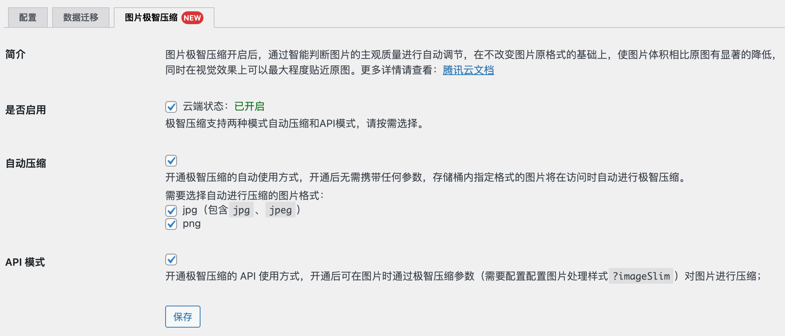

<p align="center">
    
</p>

# Sync QCloud COS

使用腾讯云对象存储服务 COS 作为附件存储空间的 WordPress 插件

[](https://github.com/sy-records/sync-qcloud-cos/releases)
[](LICENSE)
[](https://qq52o.me)
[](https://github.com/sy-records/sync-qcloud-cos/graphs/contributors)
[](https://wordpress.org/plugins/sync-qcloud-cos/)
[](https://wordpress.org/plugins/sync-qcloud-cos/)
[](https://github.com/sy-records/sync-qcloud-cos/actions/workflows/deploy.yml)

> 使用 WordPress Playground 在线预览 [Sync QCloud COS](https://wordpress.org/plugins/sync-qcloud-cos/?preview=1) 插件

## 插件特色

- [x] 可配置是否上传缩略图和是否保留本地备份
- [x] 本地删除可同步删除腾讯云上面的文件
- [x] 支持腾讯云 COS 存储桶绑定自定义域名
- [x] 支持替换数据库中旧的资源链接地址
- [x] 支持北京、上海、广州、香港、法兰克福等完整地域使用
- [x] 支持同步历史附件到 COS
- [x] 支持验证桶名是否填写正确
- [x] 支持腾讯云数据万象 CI 图片处理
- [x] 支持上传文件自动重命名
- [x] 支持媒体库编辑
- [x] 支持腾讯云数据万象图片极智压缩
- [x] 支持文件预览
- [x] 支持文本内容审核
- [x] 支持原图保护
- [x] 支持数据监控
- [x] 支持使用 `wp-cli` 命令上传/删除文件
- [x] 支持上传文件到存储桶子目录
- [x] 支持多站点

## 安装

### 后台安装（推荐使用）

WordPress 后台安装插件页面搜索`Sync QCloud COS`，点击安装

### 下载源码

从 GitHub 下载源码，通过 WordPress 后台上传安装，或者直接将源码上传到 WordPress 插件目录`wp-content/plugins`，然后在后台启用

GitHub 下载节点：[https://github.com/sy-records/sync-qcloud-cos/releases/latest](https://github.com/sy-records/sync-qcloud-cos/releases/latest)

## 修改配置

- 方法一：在 WordPress 插件管理页面有设置按钮，进行设置
- 方法二：在 WordPress 后台管理左侧导航栏`设置`下`腾讯云 COS`，点击进入设置页面
- 方法三：在 WordPress 后台管理左侧一级导航栏`腾讯云 COS`，点击进入设置页面

### 常量定义

数据监控中默认根据配置项判断是否展示`图片处理`、`文档处理`和`文本审核`的图表，如果需要强制展示或关闭，可以在`wp-config.php`中定义常量：

| 常量                     | 说明                 |
| :----------------------- | :------------------- |
| `COS_DISABLE_CHARTS`       | 禁用所有图表         |
| `COS_ENABLE_STYLE_CHART`   | 强制展示图片处理图表 |
| `COS_ENABLE_PREVIEW_CHART` | 强制展示文档处理图表 |
| `COS_ENABLE_TEXT_CHART`    | 强制展示文本审核图表 |

```php
// 禁用所有图表
define('COS_DISABLE_CHARTS', true);

// 强制展示图片处理图表
define('COS_ENABLE_STYLE_CHART', true);

// 强制展示文档处理图表
define('COS_ENABLE_PREVIEW_CHART', true);

// 强制展示文本审核图表
define('COS_ENABLE_TEXT_CHART', true);
```

## Contributors

This project exists thanks to all the people who contribute. [[Contributors](https://github.com/sy-records/sync-qcloud-cos/graphs/contributors)].

<a href="https://github.com/sy-records/sync-qcloud-cos/graphs/contributors"></a>

## 常见问题

1. 怎么替换文章中之前的旧资源地址链接

这个插件已经加上了替换数据库中之前的旧资源地址链接功能，只需要填好对应的链接即可

2. 使用子账户报错`Cos Error Code: AccessDenied, Status Code: 403`

可以使用子账户，但是 APPID 需要填写为存储桶创建者的 ID，而不是子账户的 ID。例如下文配置指南中的`1250000000`就是 APPID

3. 上传图片提示`图像后期处理失败，请将其缩小到2500像素并重新上传`

1）配置的`存储桶名称`填写错误，正确的配置参照 [配置指南](https://github.com/sy-records/sync-qcloud-cos#%E9%85%8D%E7%BD%AE%E6%8C%87%E5%8D%97) 中的`存储桶名称`

> v1.6.1 版本增强了校验，填写错误会给予提示；同时兼容了桶名称附带`APPID`的情况

2）图片确实像素大于 2500px，可以在`functions.php`中加入以下代码禁止大图片裁剪功能

```php
add_filter('big_image_size_threshold', '__return_false');
```

4. 从媒体库中删除了图片，但是`COS`中还是存在

原因是在配置页面选择了`不在本地保留备份`，因为 WordPress 机制问题，无法获取对应的文件信息

5. 在插件中应该如何使用腾讯云数据万象 CI

参考：[腾讯云对象存储 COS + 数据万象 CI = 完善的图片解决方案](https://cloud.tencent.com/developer/article/1606153) 或 [腾讯云文档 - 使用图片样式](https://cloud.tencent.com/document/product/436/42214#.E4.BD.BF.E7.94.A8.E5.9B.BE.E7.89.87.E6.A0.B7.E5.BC.8F)

6. 保存配置时报错：`您的站点遇到了致命错误，请查看您的站点的管理电子邮箱来获得指引`

这个问题应该只出现在 Windows 的机器上，打开`WP_DEBUG`的话会报错：`Fatal error: Uncaught GuzzleHttp\Exception\RequestException: cURL error 60: SSL certificate problem: self signed certificate`，解决方法如下：

1）从 [https://curl.haxx.se/ca/cacert.pem](https://curl.haxx.se/ca/cacert.pem) 下载最新的 cacert.pem  
2）将以下行添加到`php.ini`中，注意修改对应的路径

```ini
curl.cainfo=/path/to/cacert.pem
```

7. 保存配置时提示：`ErrorCode:xxx, ErrorMessage:xxxx`。如：`ErrorCode:403, ErrorMessage:Request has expired`

这种问题请直接前往腾讯云 [对象存储文档](https://cloud.tencent.com/document/product/436) 搜索对应的`ErrorMessage`信息即可，或者访问 [对象存储错误码列表](https://cloud.tencent.com/document/product/436/7730#.E9.94.99.E8.AF.AF.E7.A0.81.E5.88.97.E8.A1.A8)

8. 跟所有使用 Guzzle 组件的插件或主题都可能发生冲突，发生报错`Call to undefined method GuzzleHttp...`

不可同时开启同类插件，类似于腾讯云的官方插件 `tencentcloud-*` 系列。

## 配置指南

查看详细教程[https://qq52o.me/2722.html](https://qq52o.me/2722.html)

- 存储桶设置

> 访问 [腾讯云控制台](https://console.cloud.tencent.com/cos5/bucket) 创建存储桶，把创建存储桶时要求你填写的**存储桶名称**，把**存储桶名称**填到这里就可以了，没有后面的`-appid`。  
> `examplebucket-1250000000`，其中`examplebucket`为存储桶名称，`1250000000`为 APPID。

- 存储桶地域

> 选择你创建存储桶时所选的地域即可。  
> 如果地域选择`全球加速`，则在 COS 控制台中开启全球加速服务，具体方法和资费问题请查看 [全球加速官方文档](https://cloud.tencent.com/document/product/436/38866)

- APP ID、SecretID、SecretKey

> APP ID 填写上文存储桶设置中所说的`125000000`即可；也可以访问 [腾讯云控制台](https://console.cloud.tencent.com/cos5/key) 获取 APP ID、SecretID、SecretKey

## 插件截图





## 更新记录

[CHANGELOG](https://github.com/sy-records/sync-qcloud-cos/blob/master/CHANGELOG.md)
